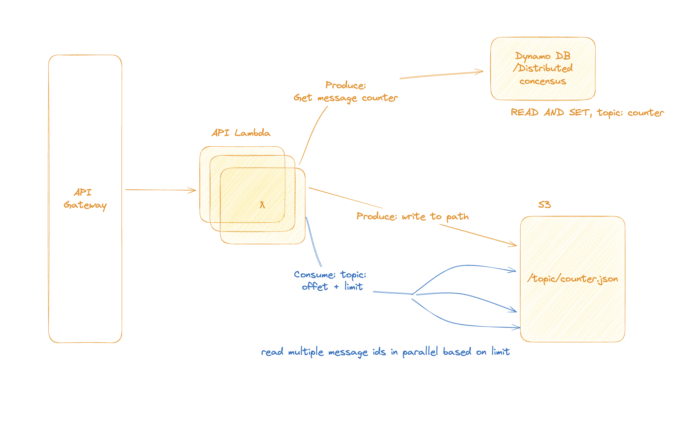

# Serverless Streams

A serverless message streaming platform built on AWS, inspired by Kafka but with true serverless architecture (scale-to-zero, pay-per-use).



## Overview

Serverless Streams provides a Kafka-like streaming API using:
- **S3** for immutable message storage
- **DynamoDB** for atomic offset counters
- **Lambda** for stateless compute
- **API Gateway** for HTTP interface

### Key Features

- ✅ **True Serverless**: Scales to zero, pay only for what you use
- ✅ **Immutable Messages**: Messages stored in S3, never modified
- ✅ **Ordered Delivery**: Atomic offset counters guarantee ordering
- ✅ **Fast Cold Starts**: Rust Lambda (~90ms)
- ✅ **Parallel Reads**: Efficient message consumption with bounded concurrency
- ✅ **Simple API**: RESTful endpoints, easy to integrate

## Architecture

```
┌─────────────────────────────────────────────────────────────┐
│  Client Application                                         │
│  (uses HTTP API)                                            │
└──────────────────────┬──────────────────────────────────────┘
                        │ HTTPS
                        ▼
┌─────────────────────────────────────────────────────────────┐
│  API Gateway                                                │
│  POST /topics/{topic}/produce                               │
│  GET  /topics/{topic}/consume                              │
└──────────────────────┬──────────────────────────────────────┘
                        │
                        ▼
┌─────────────────────────────────────────────────────────────┐
│  Lambda Function (Rust)                                     │
│  • Stateless                                                │
│  • ARM64 architecture                                       │
│  • ~90ms cold start                                         │
└──────────────┬───────────────────────┬──────────────────────┘
               │                       │
               ▼                       ▼
┌──────────────────────────┐  ┌──────────────────────────────┐
│  S3 Bucket              │  │  DynamoDB Table              │
│  • Messages as JSON      │  │  • Offset counters           │
│  • topics/{topic}/       │  │  • Atomic increments        │
│  • Zero-padded offsets  │  │  • Serverless/on-demand      │
└──────────────────────────┘  └──────────────────────────────┘
```

## Quick Start

### Prerequisites

- Node.js 23+
- Rust 1.70+
- AWS CLI configured
- AWS CDK CLI (`npm install -g aws-cdk`)
- cargo-lambda (`cargo install cargo-lambda`)

### 1. Deploy Infrastructure

```bash
# Deploy data stack (S3 + DynamoDB)
cd infra
npx cdk deploy ServerlessStreamsData

# Build Lambda
cd ../server
cargo lambda build --release --arm64

# Deploy API stack (API Gateway + Lambda)
cd ../infra
npx cdk deploy ServerlessStreamsApi
```

### 2. Test the API

```bash
# Get API URL from CDK outputs
API_URL=$(aws cloudformation describe-stacks \
  --stack-name ServerlessStreamsApi \
  --query 'Stacks[0].Outputs[?OutputKey==`ApiUrl`].OutputValue' \
  --output text)

# Produce a message
curl -X POST "$API_URL/topics/test/produce" \
  -H "Content-Type: application/json" \
  -d '{"payload": {"hello": "world"}}'

# Consume messages
curl "$API_URL/topics/test/consume?offset=1&limit=10"
```

## Project Structure

```
serverless-streams/
├── infra/              # CDK infrastructure code
│   ├── lib/
│   │   ├── data-stack.ts    # S3 + DynamoDB
│   │   ├── api-stack.ts     # API Gateway + Lambda
│   │   └── utils.ts         # Shared utilities
│   └── bin/
│       └── infra.ts         # CDK app entry point
│
├── server/             # Rust Lambda function
│   ├── src/
│   │   ├── main.rs          # Request routing
│   │   ├── produce.rs       # Produce handler
│   │   └── consume.rs       # Consume handler
│   └── Cargo.toml
│
└── README.md           # This file
```

## API Reference

### Produce Message

**POST** `/topics/{topic}/produce`

Request body:
```json
{
  "payload": {
    "any": "json",
    "data": "here"
  }
}
```

Response:
```json
{
  "topic": "orders",
  "offset": 42
}
```

### Consume Messages

**GET** `/topics/{topic}/consume?offset=1&limit=10`

Query parameters:
- `offset` (optional): Starting offset (default: 1)
- `limit` (optional): Max messages to return (default: 10, max: 100)

Response:
```json
{
  "messages": [
    {
      "offset": 1,
      "payload": {"item": "book"},
      "timestamp": 1702000000000
    }
  ],
  "next_offset": 2
}
```

## Local Development

See individual READMEs:
- [Infrastructure README](infra/README.md) - CDK deployment guide
- [Server README](server/README.md) - Lambda development guide

## Cost Model

| Resource | Cost |
|----------|------|
| **S3 Storage** | $0.023/GB/month |
| **S3 Requests** | $0.005 per 1,000 PUTs, $0.0004 per 1,000 GETs |
| **DynamoDB** | $1.25 per million writes, $0.25 per million reads |
| **Lambda** | $0.20 per 1M requests + $0.0000166667 per GB-second |
| **API Gateway** | $3.50 per million requests |

**Example**: 1M messages/month
- S3: ~$0.10 (storage + requests)
- DynamoDB: ~$1.25 (writes)
- Lambda: ~$0.20
- API Gateway: ~$7.00
- **Total**: ~$8.55/month

## Comparison with Kafka

| Feature | Kafka | Serverless Streams |
|---------|-------|-------------------|
| **Deployment** | Self-hosted or managed | Fully serverless |
| **Cost at idle** | Full broker cost | $0 (scale-to-zero) |
| **Latency** | ~5-10ms | ~50-200ms (S3) |
| **Throughput** | Very high | High (S3 limits) |
| **Storage** | Local disks | S3 (11 9's durability) |
| **Partitioning** | Yes | Single stream per topic (for now) |
| **Consumer Groups** | Yes | TODO |

## Limitations

- **No partitioning**: Each topic is a single stream (can add later)
- **S3 latency**: ~50-100ms per operation (vs Kafka's ~5ms)
- **No batching**: Individual messages written to S3 (can optimize later)

## Roadmap

- [ ] **Client SDKs**: Python, TypeScript, Go
- [ ] **Consumer Groups**: Automatic offset tracking
- [ ] **Branching**: Branching in a topic similiar to what NEON does
- [ ] **Message Batching**: Batch writes for better S3 efficiency
- [ ] **Partitioning**: Multiple partitions per topic
- [ ] **Streaming**: WebSocket/SSE for real-time consumption
- [ ] **Compression**: Gzip/Zstd for large messages
- [ ] **Retention Policies**: Configurable message TTL
- [ ] **Monitoring**: CloudWatch dashboards and alarms
- [ ] **Testing + Benchmarking**: Thorough test suite and benchmarks for throughput and race conditions

## Contributing

This is a learning project. Feel free to:
- Open issues for bugs or feature requests
- Submit PRs for improvements
- Fork and adapt for your needs

## License

MIT

